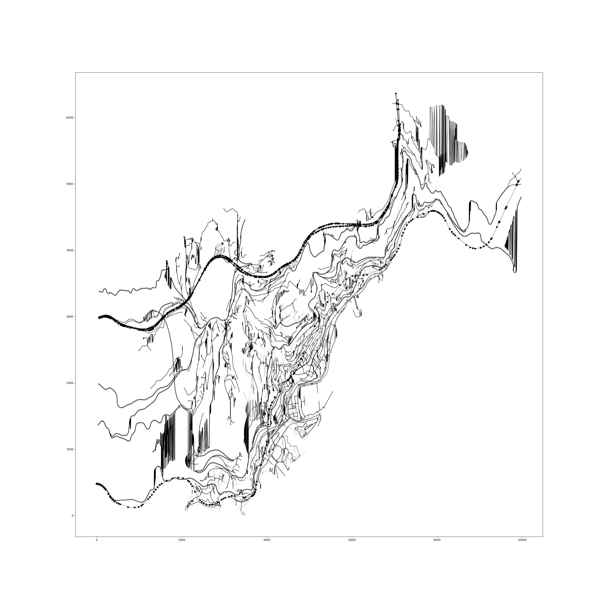

# What's this?

This project is extracting sensor-information and trajectory-information from SUMO simulation,
where the study scenario is "Monaco scenario".

"sensor-information" is an array of `(|S|, |T|)`, where `S` is a set of sensors, `|T|` is a set of timestamps. 
Note that I use `lane` as a sensor.
The Monaco scenario does not have enough detectors.

"trajectory-information" is an array of `(|A|, |T|)`, where `A` is a set of agents (vehivle, public transportation etc.)

# Setup

`poetry install`


# How to use?

A toml file is necessary.

`task_pipeline.py` is an interface.

# Map Visualization

`visualize_network.py` is the CUI interface for visualizing the study map.

The example output is .

This script is able to highlight specific roads. You need a json file having a structure below,

```
[
    [lane-id: str, weight: float]
]
```

