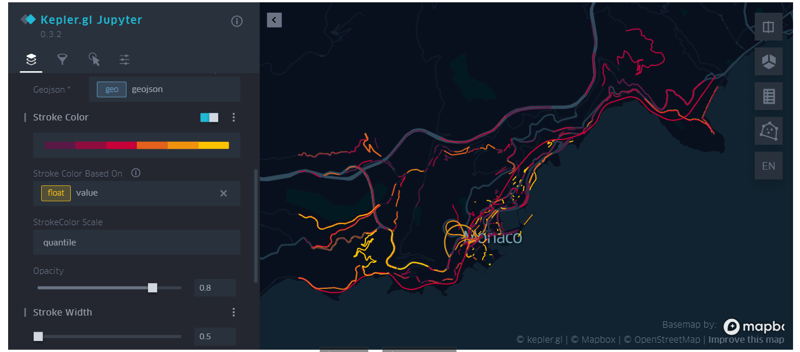

# What's this?

This project is extracting sensor-information and trajectory-information from SUMO simulation,
where the study scenario is "Monaco scenario".

"sensor-information" is an array of `(|S|, |T|)`, where `S` is a set of sensors, `|T|` is a set of timestamps. 
Note that I use `lane` as a sensor.
The Monaco scenario does not have enough detectors.

"trajectory-information" is an array of `(|A|, |T|)`, where `A` is a set of agents (vehivle, public transportation etc.)

# Setup

`poetry install`


# How to use?

A toml file is necessary.

`task_pipeline.py` is an interface.

# Map Visualization

## Static PNG visualization

`cli_tools/export/visualize_network.py` is the CUI interface for visualizing the study map.

The example output is .

This script is able to highlight specific roads. You need a json file having a structure below,

```
{"lane_id": "-152191_0", "weight": 1.8016666666666667, "time_bucket": 8, "label": "Average during 4800 until 5400"}
```

Among these fields, the mandatory fields are "lane_id" and "weight".


## Dynamic External Tools

A script `cli_tools/export/export_to_gis_tools.py` generates an input file for either Kepler.GL and Google Earth. I strongly recommed using Kepler.GL as the analysis tool. Below, an example screenshot with Kepler.GL.




The script requires a config file. See `configurations/config_export/config_export_gis_tools.toml` as the example configuration file.

You have to specify a path to jsonline file. The jsonline file holds weight values as I show an example below.

```
{"lane_id": "-152191_0", "weight": 1.8016666666666667, "time_bucket": 8, "label": "Average during 4800 until 5400"}
```


## Simple Analysis Script

An easy analysis script is ready to use: `cli_tools/simple_analysis/make_aggregation.py`.

This script generates the weight jsonline file.


